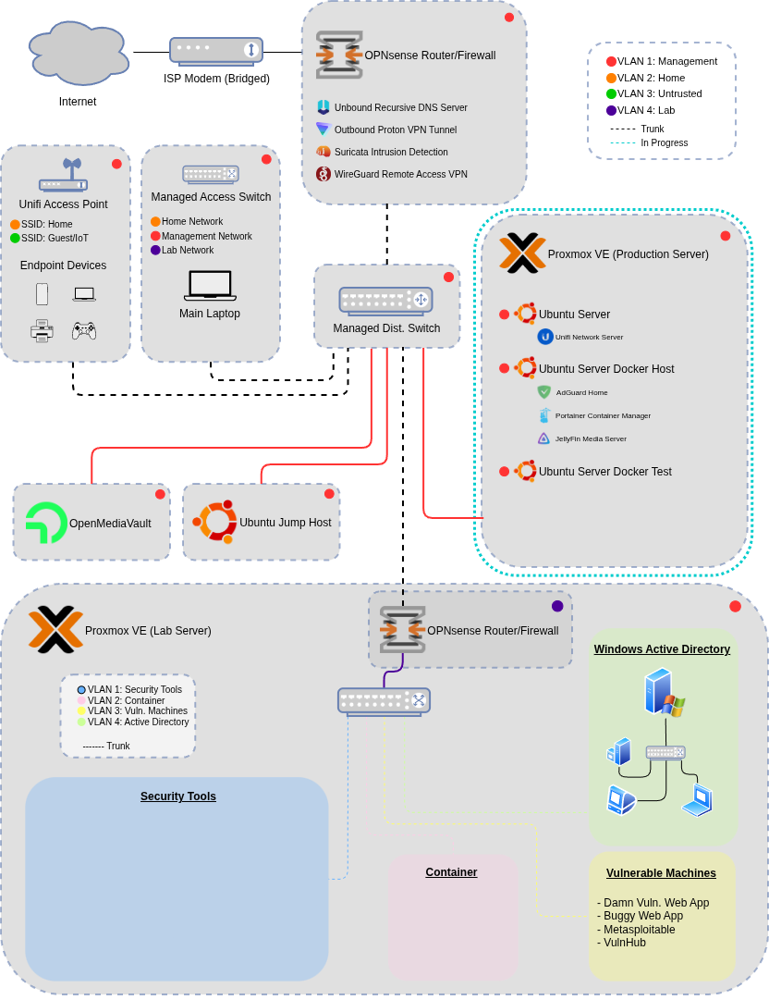

# Cybersecurity Lab

A hands on lab focused on cybersecurity, enterprise style network design, and IT best practices.

## Lab Overview

This lab simulates a small enterprise network with segmented security zones, firewalling, virtualized workloads, and layered defenses, enabling both blue-team (defensive) and red-team (offensive) cybersecurity practice. 

### Architecture Diagram

**IN PROGRESS:** Production Proxmox server deployment and hardening

**Note:** This is not all configured as of yet and is subject to change as the lab develops

## Objectives

- Design and operate a segmented enterprise style network
- Build a secure virtualized lab environment
- Implement layered security controls across the entire network
- Develop hands on blue and red team cybersecurity skills
- Document and automate lab infrastructure
- Enable controlled offensive security testing

<strong>Technology Stack</strong>

- OPNsense 25.7.10
- Netgear 24 port managed switch (GS728TPV2)
- TP-Link 8 port managed switch (TL-SG108E 6.0)
- Unifi Network Server (10.0.156)
- Unifi Access Point (AP AC Pro)
- Proxmox VE (9.1.4)
- Unbound Recursive DNS
- WireGuard VPN (network level)
- ISC DHCPv4
- Packet capture
- Traceroute
- Firewall logs

## Lab Modules

Documentation approach: Each module includes an overview, architecture details, key security configurations, challenges/validation and summarized implementation notes.

**OPNsense Firewall Deployment & Baseline Hardening**  
Firewall installation, interface configuration, NAT, DNS, DHCP, logging, VPN, device hardening  
→ [opnsense-deployment](labs/opnsense-deployment/opnsense-deployment.md)

**Local Network Segmentation w/ VLANs**  
Network security zones, switch & WAP configuration, firewall rules, 802.1Q VLAN trunking, wireless & ethernet networking  
→ [local-network-segmentation](labs/local-network-segmentation/local-network-segmentation.md)

## Roadmap

- [X] OPNsense deployment
- [X] VLAN based network segmentation
- [X] Production Proxmox server deployment
- [...] Production Proxmox server hardening
- [...] Ubuntu server (VM) deployment & hardening 
    - Install Unifi Network Controller and import configuration
- [...] BIOS/UEFI hardening on all devices
- [...] Network device hardening
    - Managed switches
    - OPNsense firewall
    - Unifi wireless access point(s)
- [...] Deploy Ubuntu server to use as a Docker host
- [...] Lab Proxmox server deployment & hardening

## About Me

This lab is part of a broader GitHub portfolio. For an overview of my background and other projects, see my [GitHub Profile](path/to/file.md)
