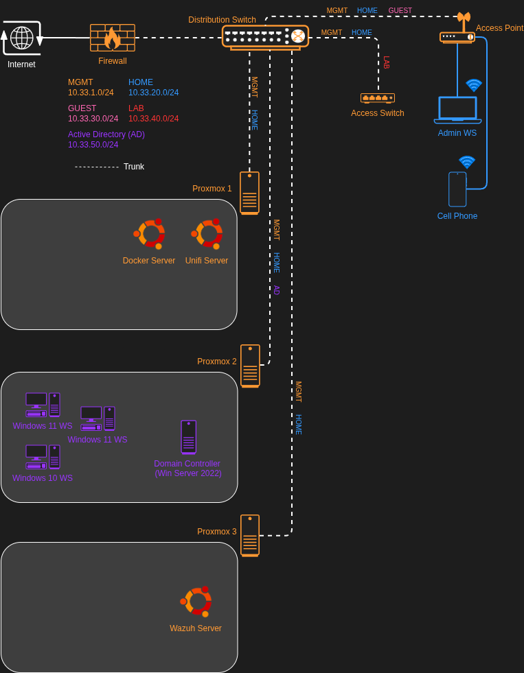
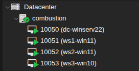
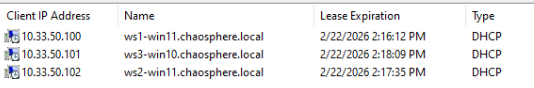
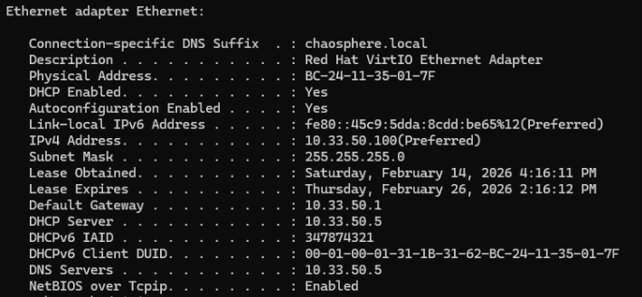

# Building an Active Directory Testing Environment

## Overview

This lab showcases the architecture of the local Active Directory (AD) network I created in my home lab. The primary purpose of domain network is to test offensive security tactics while also generating defensive security alerts and responses in a controlled setting. The general process for creating an Active Directory Domain Controller (DC) and adding clients to it can be readily found online and thus, this lab will largely consist of how I nestled this domain into my local network and the future plans I have for it.

## Architecture & Data Flow

The domain is segmented from other local network traffic on its own VLAN and segmented physically on a single Proxmox host

The DC uses the firewall DNS server; domain clients use the DC for DNS and DHCP

Managing the domain devices requires access to the MGMT subnet or the admin workstation on the HOME subnet

### Network Diagram w/ VLANs

### The Virtual Machine Lineup

## Key Security Configurations

| Area | Configuration | Security Purpose | Notes |
|---------|-----------------------|---------------------------|-----------|
| Segmentation | environment is segmented from other traffic | prevents testing effecting production systems | N/A | 
| Access Control | direct Proxmox access required to manage systems | lock down sensitive testing environment | additional access may be required during attack simulations (SSH, etc) | 
| Weak Environment | misconfigured by design | provides testing situations | requires the environment be locked down as it is insecure by design |
| DHCP & DNS | DC handles services common to enterprise networks | provides more realistic testing | configure this environment with more common services in the future |
| Monitoring | this environment will be monitored with all the security tooling hosted in the lab | gain hands on insight into Windows system logs | install sysmon to improve logs? |

## Validation & Evidence

### Confirm the DHCP server is handing out IP addresses to clients on the network
- Expected result: Three DHCP reservations will be present on the DHCP server
- Evidence (screenshots / logs):

### Ensure the DNS server is set as the DC IP address for all clients
- Expected result: Clients get the correct IP configuration and can access the internet
- Actual result: Clients are assigned the DCs IP address for the DNS and DHCP servers which is correct
- Evidence (screenshots / logs):

### Confirm domain DNS queries are forwarded to the firewall upstream and sent over TLS
- Expected result: DNS leak tests from client devices show DNS servers configured on Unbound (DNS over TLS)
- Actual result: The DNS servers match clients on other local networks, confirming DNS forwarding from the DC to the firewall is working

## Future Enhancements

- Add Windows Group Policy
- Intentionally misconfigure components of the environment to exploit
- Install Wazuh agent for log analysis
- Implement a hybrid setup for additional attack surfaces
- Attempt various exploits and offensive security practice

## Next Project

My next project will be to connect all of the devices on my network to the Wazuh server for centralized monitoring and protection. This will involve installing the Wazuh agent on many different operating systems (Linux, Windows, FreeBSD, embedded). Additionally, traffic will have to be explicitly allowed through the various layers of firewalls running on the network.

