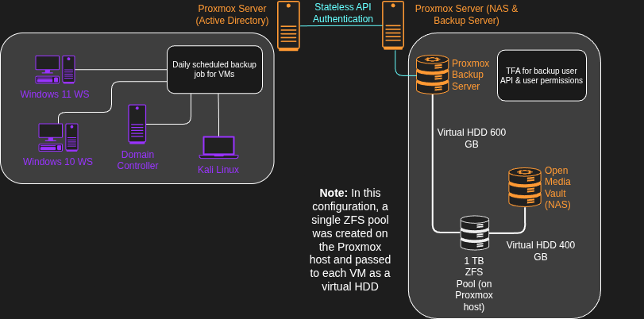
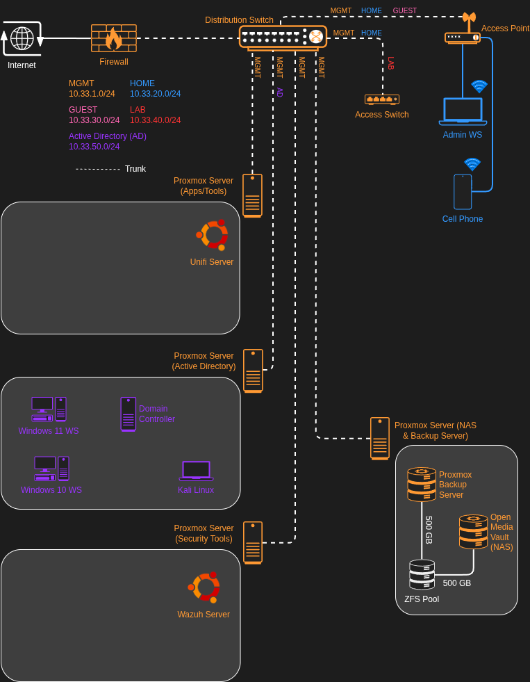
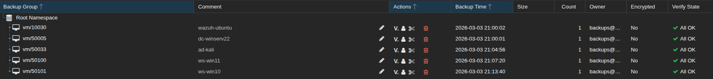

# Proxmox Backup Server Deployment

## Overview

The purpose of this lab was to build a central backup and file storage solution on my enterprise inspired home lab network. This centralized storage hub will be the core to my disaster recovery implementation, allowing for quick restoration of systems affected by malware, misconfiguration, or other system failures.

## Architecture & Data Flow

### Machine provisioning & design
The backup server physically resides on an HP desktop computer with the following storage 
- 500 GB SSD (OS drive)
- 1 TB HDD (data drive1)
- 1 TB HDD (data drive2)

The core OS for the system is Proxmox, which is installed on the SSD. Both Proxmox Backup Server (PBS) and Open Media Vault (OMV) are installed as virtual machines on the hypervisor. The HDDs are configured as a ZFS mirror pool providing 1 TB of usable storage. This storage is passed to the virtual machines as virtual disks.

### Data flow

**General process**
- ZFS pool configured on Proxmox host 
- Pool passed as a virtual disk to the VMs
- PBS datastore connected to the other Proxmox nodes via API 
- Scheduled backups of select VMs to PBS

### Network architecture
- The Proxmox server that hosts the backup machines sits on the MGMT subnet
- Both PBS and OMV sit on the MGMT subnet

 

## Key Security Configurations

| Area | Configuration | Security Purpose | Notes |
|---------|-----------------------|---------------------------|-----------|
| Segmentation | backup machines are on segmented subnet | prevents lateral movement and provides distinct security zones | may implement a backup subnet in the future | 
| Access Control | tight access control for web GUI and SSH access | prevents unauthorized access | OMV and PBS require additional controls |
| Automated Backups | automatic backup jobs configured for VMs on the network | provides protection against malware, data loss, etc | recovery testing is required |
| Backup User | specific user created with restricted permissions for backup jobs | limits blast radius of account compromise | this is going to be a common practice in my lab |
| API Authentication | PBS datastore is added to each Proxmox server using an API token and ID | provides stateless authenticated connection that can have granular permissions | required if 2fa is enabled on backup user |
| Data Redundancy | ZFS mirror pool configured on Proxmox host | allows for a single drive to fail before backup data is lost | highly limited on resources for this |
| Email Notifications | emails sent to main inbox via smtp | increases visibility of the backup process | notification tuning required |

## Validation & Evidence

### Confirm restricted SSH access to the Proxmox host, PBS and OMV
- SSH access only works from the admin workstation using key authentication only

### Test backups from a single Proxmox node after the full setup is complete
- Virtual machines from the Active Directory lab were backed up using a scheduled event
- Backups were present the day after on the PBS server and matched the scheduled time

## Challenges

The biggest challenge in this entire process by far was designing the system to be useful with limited hardware. The system I am using supports two HDDs and a single M.2 drive. I decided I wanted to go with a RAID configuration for redundancy at the cost of 50% of my storage capacity.

I also had multiple types of backups I wanted to do. I needed a solution to backup VMs and config/general files. This is what led me to virtualize both PBS and OMV on a single hypervisor, allowing for hyper efficient VM backups and the flexibility of a lightweight NAS solution with one PC.

## Future Enhancements

- Upgrade physical hardware and add more drives
- Encrypt the backups from Proxmox nodes to PBS
- Monitor backup traffic over the network using Security Onion
- Install Wazuh agent for endpoint monitoring
- Implement automatic backups for OPNsense, Unifi server, and other local devices
- Create NFS shares on OMV for shared network resources
- Tune notifications for PBS and OMV to include critical events

## Next Project
I am currently deep in the process of standing up infrastructure and learning about the core components that make up an enterprise network. The primary focus is to move this lab towards more security related topics, which begins with basic security controls, keeping systems patched, and maintaining good backups.

Now that a solid backup solution is built, I plan to move forward with the implementation of Wazuh for endpoint detection and response. This will be followed by additional security tooling to create a full security operations center environment in my home lab.

