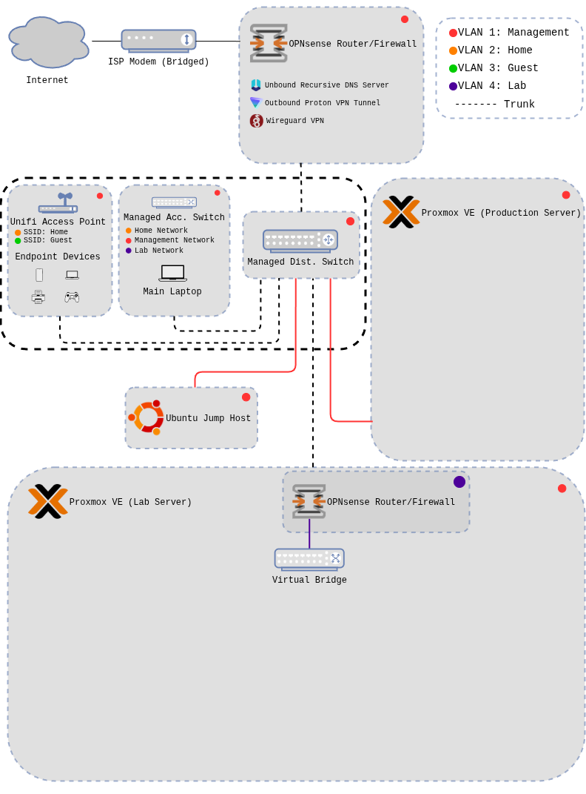
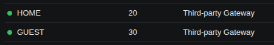
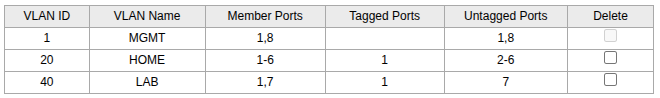

# Local Network Segmentation

## 1. Overview

This lab focuses on the process of segmenting my home lab network to provide a powerful layer of security by separating devices into distinct security zones. This is achieved through the use of virtual local area networks (VLANs), Managed switches, and VLAN capable access points, allowing for multiple virtual networks to reside on a single physical network. This segmentation is done to ensure that if a device is compromised on one network segment, the entire network is not compromised.

<strong>Technology used during this lab</strong>

- OPNsense 25.7.10
- Netgear 24 port managed switch (GS728TPV2)
- TP-Link 8 port managed switch (TL-SG108E 6.0)
- Unifi Network Server (10.0.156)
- Unifi Access Point (AP AC Pro)
- Proxmox VE (9.1.4)
- Unbound Recursive DNS
- WireGuard VPN (network level)
- ISC DHCPv4
- Packet capture
- Traceroute
- Firewall logs

## 2. Architecture & Data Flow

The core networking devices are within the black dot area which will be the focus for this lab. These devices include:

- 24 port managed switch (PoE+)
- 8 port managed switch
- Unifi access point

This physical network acts as the "parent" for the VLANs. The firewall then controls what traffic can pass between these segmented virtual networks.

## 3. Key Security Configurations

| Area | Configuration | Security Purpose | Notes |
|---------|-----------------------|---------------------------|-----------|
| Firewall Policy | Default deny on WAN and inter VLAN traffic | Prevents unauthorized ingress and lateral movement | Explicit allow rules defined per service |
| Network Segmentation | Separate VLANs for management, trusted clients, untrusted clients, and lab testing | Limits scope of compromise if a single system is affected | Inter VLAN traffic is restricted by default |
| Zone: MGMT | Accessible from a single physical port on the network | Connecting to this interface is required to make configuration changes to infrastructure devices | Additional hardening is required (port security, disabling ports) |
| Zone: HOME | Accessible via wire and wireless | Primary network that will have access to internal servers and the internet | Firewall rules are required to allow traffic to the MGMT zone for each service |
| Zone: GUEST | Accessible wirelessly | Network for untrusted IoT devices/guests | Encrypted internet access only | Client device isolation is also enabled to restrict lateral access | 
| Zone: LAB | Accessible from a single physical port on the network | This interface will allow connection to the Proxmox server that will act as a testing environment | Effectively the WAN network for the firewall sitting at the edge of the lab testing environment |
| VPN Gateway Routing | Firewall rule on each interface to route traffic from the internal network to the VPN gateway | Encrypts all outbound traffic, providing a layer of privacy from the ISP | DNS is still running on the WAN over TLS | 
| Unbound DNS over TLS | Firewall rule was required for each interface that allowed traffic to the firewall over port 53 | Provides DNS forwarding over TLS, Encrypted outbound DNS traffic | Required for internet access on each VLAN |
| Port Security | Disabled unused ports on distribution switch, enabled port security for the access switch MGMT port | Lock down network access to intended entry points | More security measures will be put in place for the HOME network |

### Network Zone Details

<strong>Management</strong>

- Core infrastructure devices  
- Highly secure, limited access  
- Serves the HOME network  

<strong>Home</strong>

- Trusted endpoint devices  
- Secure primary network  
- Access to internal services  

<strong>Guest</strong>

- Untrusted endpoints  
- Insecure by design
- No access to internal services
- Client isolation (internet access only)  

<strong>Lab</strong>

- Lab and test devices  
- Secure  
- No inter-VLAN access  
- Single virtualized environment  

## 4. Challenges

### Unable to connect to the wireless networks after setting up the access point
- I found a default (unchangeable) vlan configuration on the distribution switch that conflicted with my VLAN numbering scheme.
- Changed the VLAN ID configuration at the firewall interface level, the switch level, but did not do so in the Unifi network controller which resulted in the wireless networks having the wrong VLAN tag.
- Changing this on the controller allowed me to connect and get TCP/IP settings from the DHCP server running on the firewall, confirming the VLAN tagging was working.

### Unable to access the internet on the wireless networks
- firewall rules were required to access the internet on each VLAN
- Pass rule to allow local networks access to the VPN gateway
- Pass rule to allow each VLAN network access to the firewall over port 53 for Unbound DNS
- These rules allowed access to the internet while restricting access to other VLANs

### Unable to access the internet from the access switch
- When connected to the MGMT port, I can access devices locally
- Unable to access the internet on any port
- VLAN tagging behavior was configured correctly but PVID settings were overlooked
- Configured each interface with the PVID corresponding to the destination VLAN
- This put clients on the correct network for each port
- LAB network required the DHCP server on OPNsense be configured prior to any networking. After this was complete, internet was accessible from that port
- MGMT port could access local devices but not the internet, found a conflict with tagged default vlan traffic at layer 3.
- VLAN 1 traffic was being tagged outbound from the access switch. The distibution switch and OPNsense understood this traffic but it likely broke at the NAT level, which did not understand this tagged VLAN 1 taffic as the default VLAN. 

## 5. Validation & Evidence

### Verify TCP/IP settings on wireless networks 
- Expected result: Each wireless network will provide an IP address via DHCP that is configured at the firewall level. This confirms that VLAN tagging is working correctly on the firewall, switch, and access point.
- Actual result: IP addresses were assigned on each network that were configured at the firewall level. VLAN tagging is working correctly for both wireless networks

### Verify TCP/IP settings on wired networks
- Expected result: Each port will provide an IP address configured at the firewall level. This confirms that each port puts the client on the correct network and VLAN tagging between the switches is working correctly
- Actual result: Each port provides the correct IP address for the desired VLAN.

### Verify internal device access and internet access
- Expected result: All networks should have access to the internet and the public IP address should reflect the VPN gateway IP. The MGMT network should have access to internal devices while all other networks do not.
- Actual result: All networks, both wired and wireless, have internet access and DNS leak test shows the correct information. Only the single port on the access switch allows access to internal devices for administration.

### Ensure inter VLAN traffic is blocked
- Expected result: Ping tests from each network to all other networks results in 100% packet loss
- Actual result: Laboriously, connecting a host to one network and pinging a device to each other network resulted in no communication between the internal networks.

## 6. Future Enhancements

- Additional VLAN for services
- Firewall rules allowing HOME clients access to services running on MGMT
- Switch tagging for devices shown on network diagram but out of the scope of this lab
- Port mirroring with security tools (Security Onion)
- Wireless MAC address filtering
- Advanced layer 2 configurations
- Switch hardening

## 7. Field Notes (Summarized)

### Network device deployment: 

**Configure**: Hostname, Timezone, Static IP on MGMT network (firewall level), VLAN assignments

**Basic Hardening**: Complex password, Apply updates

- 24 port distribution switch
- 8 port access switch
- Wireless access point

**Note**: To configure the access point, I needed to spin up a Unifi network server. I decided to spin up the bones of my next project which will be deploying and hardening a Proxmox server. I got the server running and created an Ubuntu server virtual machine which hosts the network server. This allowed me to configure the wireless networks and VLANs on the access point.

### Wireless network configuration:
- Adopt access point to server
- Create VLAN networks
- Create wireless networks
    1. Set VLAN network
    2. Strong password
    3. Client device isolation (GUEST network)
    4. Hide network name (HOME network)
    5. WPA3 security protocol

### Distribution switch configuration
- Create VLANs w/ corresponding tags
- Switch ports connected to devices are configured to carry the correct VLAN traffic for that device

### Access switch configuration
- Access switch ports configured to carry traffic for desired network
- Set PVID settings to match the VLAN ID for the network each port should land on

### Firewall configuration

**Note**: This was done in a previous writeup in greater detail.

- Create VLANs
- Assign each VLAN to an interface
    - Enable and set IP address
- Enable the DHCP server for each interface

### Firewall rules
- Create firewall rule passing traffic from each VLAN to the VPN gateway
- Create firewall rule allowing DNS traffic to the firewall for Unbound DNS

## 8. Next Projects
For my next project I will be going through the installation, configuration, and hardening process for a production Proxmox server. This will be the procedure I follow to spin up the Lab Proxmox server as well. This devices will be used to run all sorts of technology that I am super excited to dig into.

I welcome your feedback. If you would have done anything differently or would like to discuss how you handle similar challenges, message me on LinkedIn.

