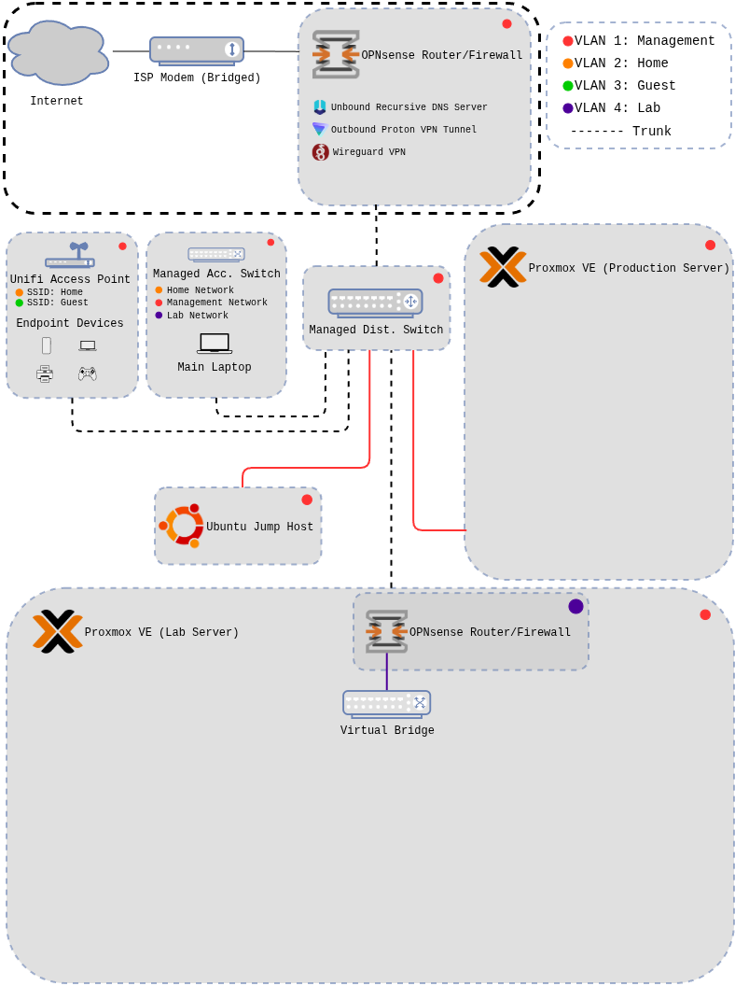
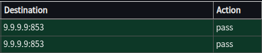

# OPNsense Deployment

## 1. Overview

This document outlines the process and design behind deploying an OPNsense perimeter firewall to enhance network security and privacy within my home lab environment. The goal of this deployment is to improve control over the network by implementing advanced features such as network segmentation, outbound traffic encryption, and robust security controls.

This approach provides significantly greater visibility and control compared to the basic security solutions typically offered by internet service providers, allowing for improved protection against potential threats and a more secure, private network setup.

<strong>Technology used during this lab</strong>

- OPNsense 25.7.10
- Unbound Recursive DNS
- WireGuard VPN (network level)
- ISC DHCPv4
- Packet capture
- Traceroute
- Firewall logs

## 2. Architecture & Data Flow

**Note:** The network segment marked by a black-dot boundary will be the focus of this lab. The rest of the diagram provides a high level overview of the core devices located on the restricted management network.

- The firewall sits between the ISP modem and the internal network, providing a critical security boundary between trusted and untrusted network zones

- The ISP modem is configured in bridge mode to pass the public IP address directly to the OPNsense WAN interface, reducing the upstream attack surface

### Network Zone Details

<strong>Management</strong>

- Core infrastructure devices  
- Highly secure, limited access  
- Serves the HOME network  

<strong>Home</strong>

- Trusted endpoint devices  
- Secure primary network  
- Access to internal services  

<strong>Guest</strong>

- Untrusted endpoints  
- Insecure by design
- No access to internal services
- Client isolation (internet access only)  

<strong>Lab</strong>

- Lab and test devices  
- Secure  
- No inter-VLAN access  
- Single virtualized environment  

## 3. Key Security Configurations

The following table highlights the most impactful security configurations applied during the deployment of this OPNsense firewall.

| Area | Configuration | Security Purpose | Notes |
|---------|-----------------------|---------------------------|-----------|
| Firewall Policy | Default deny on WAN and inter VLAN traffic | Prevents unauthorized ingress and lateral movement | Explicit allow rules defined per service | 
| Network Segmentation | Separate VLANs for management, trusted clients, untrusted clients, and lab testing | Limits the blast radius if a host is compromised | inter VLAN traffic restricted by default | 
| Management Access | Web UI restricted to management VLAN | Protects firewall administration interface | All core devices will reside on management VLAN to restrict access |
| Access Control | Root account access is disabled, a user account was created for auditing | Locks full root access to the system | MFA planned for the secondary user account |
| Updates | Automatic email alerts configured from the OPNsense forum | Ensure that updates happen timely but are only applied after careful review | Snapshot before minor updates and image the system before major version upgrade |
| Proton VPN Tunnel | Network level VPN for all devices on the network | Encrypts traffic outbound from the network | Additional work needed to configure Unbound DNS over the VPN tunnel
| DNS | Internal DNS resolver with blocklists | Reduce exposure to malicious domains & internalize sensitive system that expose private information | DNS queries are sent over TLS, encrypting packet contents | 

## 4. Validation & Evidence

### Verify Unbound is working correctly and resolving IP addresses (using DNS over TLS)
- Expected result: Unbound logs populate as web traffic is generated, and firewall logs show the correct ports for DNS over TLS
- Actual result: 
    - Confirmed that TLS was used to the destination DNS provider (Quad9) in the live firewall logs

    

    -   The logs showed that local resolving was occurring and the report dashboard showed blocked/resolved domains

### Verify the WireGuard connection is established
- Expected result: The connection is established if bytes are sent over the wire
- Actual results: The connection is showing bytes both sent and received so the connection is established

### Verify that outbound traffic is routed through the VPN tunnel
- Expected result: Public IP, DNS server configuration, Firewall logs and traceroute reflect VPN provider configurations
- Actual result:
    - DNS leak tests shows the VPN provider IP address and DNS servers, not the public IP from my ISP
    - A packet capture on the WAN and VPN interfaces shows that the only traffic passing the WAN interface is DNS over TLS and WireGuard traffic
    - The remainder of traffic was passing the VPN interface and was going through the encrypted tunnel

### Verify networks are properly segmented with firewall rules 

Detailed verification for network segmentation will be included in a future write up when I can put devices on those networks and test rules as they are created.

## 5. Future Enhancements

- Implement MFA on the none root administrator account to provide secondary layer of security
- Deploy networking equipment to build out VLANs and segment network traffic into distinct zones
- Configure firewall rules to explicitly allow traffic between zones and ensure this traffic is properly logged
- Migrate from the legacy ISC DHCP server to Kea DHCP and take advantage of the additional security features included
- Configure DNS over TLS through the outbound network VPN interface to provide double encryption for all DNS traffic on the network
- Implement a DNS level adblocker such as Pi-Hole or AdGuard Home

## 6. Field Notes (Summarized)

- Install OPNsense and configure general system settings
    - Hostname, timezone, etc..
- Configure access control (new admin user, disable root account)
    - Generate long and randomized passwords for each account
    - Create admin user
    - Disable root login
    - Ensure SSH is disabled
- Configure interfaces
    - Create VLANs and assign to interfaces
    - Set static IPs for each network
- Configure the DHCP server to include an appropriate address pool for each network
- Set up unbound to forward DNS queries over TLS to Quad9
- Disable IPv6 to understand my firewall rules/logs better
- Updated the system
- Set up update notifications for manual review
- Set up network VPN via WireGuard
    - Ran into issues routing DNS traffic from the local Unbound server. I decided to disable this for now. DNS is routed over the WAN via TLS while the rest of the traffic is routed over the VPN interface
- Verified that the correct traffic was routed over the VPN tunnel
    - Unable to route all traffic (DNS) through the VPN tunnel, further testing is required to land on a configuration that allows for DNS to be encrypted (over TLS) through the VPN tunnel. I have located documentation on this setup that I will test and report on in the future.

## 7. Next project

With the brain of the network spun up, I now need to implement the physical network for the VLANs to reside. This will involve deploying the following:
    
- Core 24 port distribution layer switch w/ PoE+ (access point power)
- 8 port access layer switch for the main workstation/administration
- Access point for wireless access to several of the networks outlined previously. 
    
There will be a writeup for that process as I proceed with the construction of this network. I welcome your feedback, advice and comments. Reach out for a chat, I am always happy to help how I can. 

