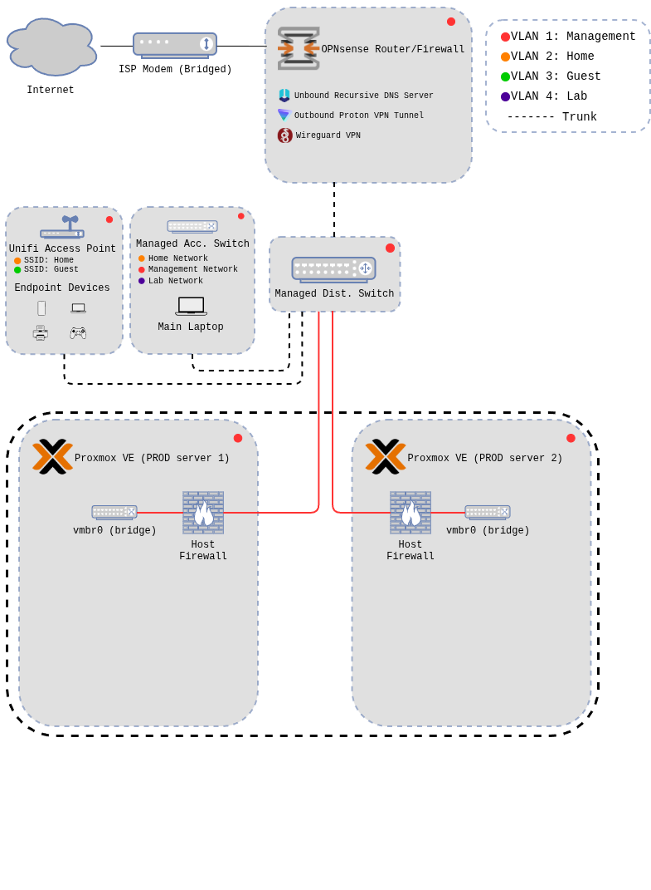
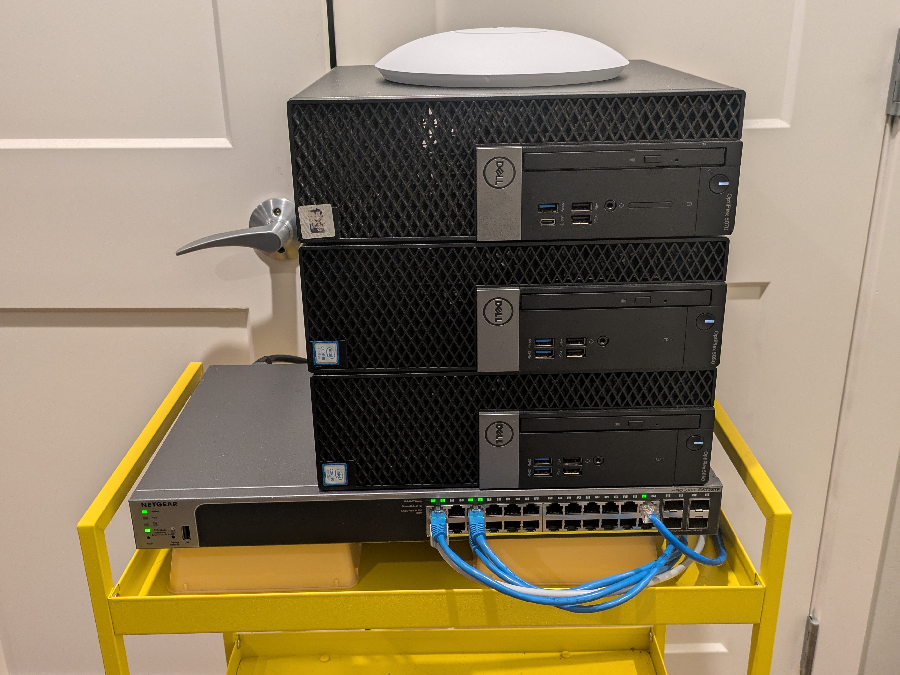
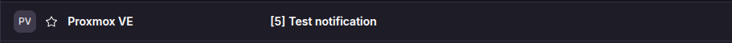

# Proxmox Hypervisor Deployment & Hardening

## 1. Overview

This lab focuses on the installation, configuration and hardening of two Proxmox hypervisors that will act as the primary production servers in my home lab environment.

The importance of securing systems this critical cannot be overstated and thus, these hosts must be locked down and constantly monitored to ensure the rest of the lab remains secure.

## 2. Architecture & Data Flow

### Network diagram

The section of this diagram outlined with a black dotted line will be the focus of this lab. Previous labs have gone through the firewall and VLAN setup process.
- Servers are linked to the distribution switch and placed on the MGMT VLAN
- Virtual devices on the hosts reside on the MGMT VLAN

### Physical devices

The majority of my infrastructure devices sit on this little Ikea rolling cart. These systems are (from top to bottom): 
- Unifi access point (wireless)
- Proxmox production server (2)
- Proxmox production server (1)
- OPNsense firewall
- Netgear distribution switch

There is nothing impressive about these machines, but they are perfect for getting hands on with any technology I want to learn more about.

## 3. Key Security Configurations

| Area | Configuration | Security Purpose | Notes |
|---------|-----------------------|---------------------------|-----------|
| Host & VM Isolation | placed on the restricted MGMT VLAN | restrict administrative access | services may be further segmented from MGMT in the future | 
| Host-Based Firewall | firewall at the data-center and node level | restricting traffic to what is explicitly allowed | Add rules for future services
| Access Control | user specific admin account created, root disabled | limit full root access and improve system auditing | user admin is a sudo user w/ MFA enabled | 
| SSH Security Configuration | disable root SSH, disable password authentication | lock down root SSH access to the machine | explicitly allowed admin user
| SSH Key Authentication | set up SSH key authentication | stops brute force attacks over SSH | key is locked w/ passcode | 
| Notifications | SMTP notifications to main email inbox | keep informed about what is happening w/ the system in real time | monitor backups, security events, etc. |

## 4. Validation & Evidence

### SMTP server configuration sends test notifications to main inbox
- Result: A test email is test from the configured SMTP email to my main email inbox via the alias I set up.

### Administrator access for non root user
- Expected result: The non root user should be able to SSH into the machine and access virtual machines/other admin panels in the web UI
- Actual result: All access is as expected after the user was added to the administrators group in the Proxmox UI

### SSH access behaves as expected for all users
- Expected result: The root user should not have SSH access, The non root user should be able to SSH via key authentication but not using a password.
- Actual result:
    - SSH access w/ the root account says permission denied
    - Password authentication with any user throws a public key error
    - Key authentication works on main workstation for non root user

### Web UI access is restricted to the MGMT VLAN
- Expected result: The web UI is only available when the device connecting is sitting on the MGMT VLAN
- Actual result:
    - The UI is not accessible when on any VLAN other than MGMT

## 5. Future Enhancements

- Implement automated backups w/ Proxmox Backup Server
- Monitor nodes w/ security tools (SIEM, IPS, EDR)
- Set up Fail2Ban for brute force protection
- Configure a trusted TLS certificate
- Build virtual machines and host services
- Cluster the server with additional hardware

## 6. Next Projects

My next projects will include the creation and configuration of multiple Linux server virtual machines. These will be used to host services that will also be the topics of future labs.

Some of these will notably host security tooling like Nessus vulnerability scanner and Wazuh SIEM & XDR. These will be the highlight of this lab environment along with the red team antics made to trigger alerts and responses from these tools.