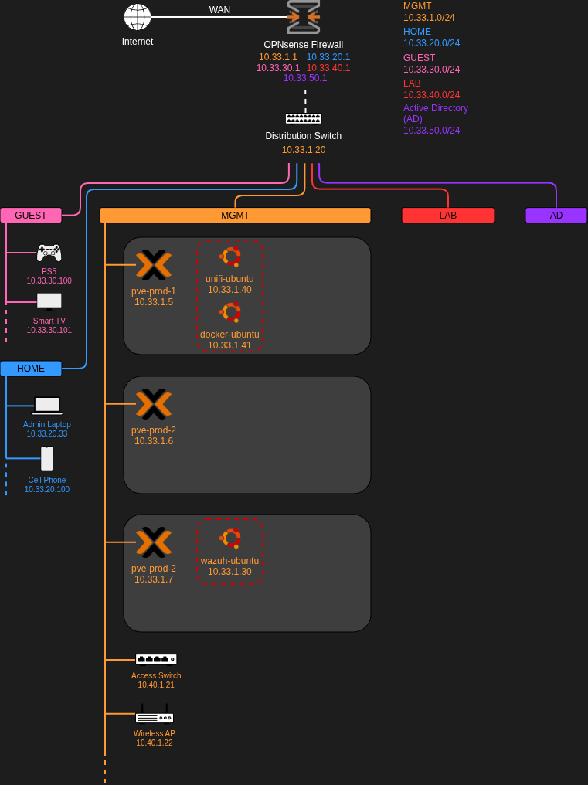
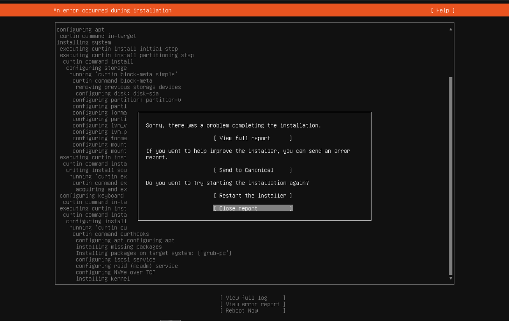
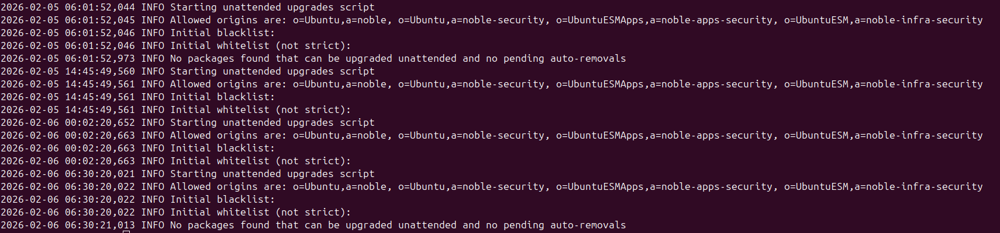
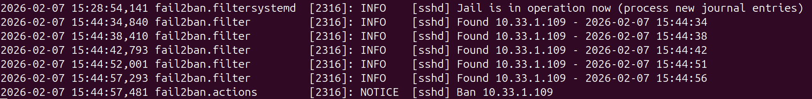
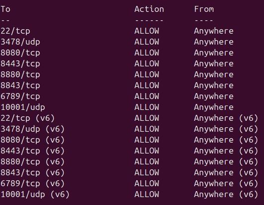

# Ubuntu Server Deployment & Hardening

## 1. Overview

This lab outlines my process for spinning up Linux servers in my home lab environment. Most of the applications and services running in my lab will be hosted on virtualized Linux servers.

My goal for this was to learn the baseline hardening techniques and develop a procedure for consistent deployment. Eventually I will automate this but for now its commands at the terminal to get these set up.

<strong>Technology used during this lab</strong>

- Ubuntu Server 24.04.3
- Proxmox VE 9.1.4
- OPNsense 25.7.10
- openSSH
- unattended-upgrades
- fail2ban
- uncomplicated firewall (ufw)
- Virtual machines
- Unifi Network Server
- WireGuard VPN (network level)
- ISC DHCPv4

## 2. Architecture & Data Flow

The three virtual machines I plan to create will be split between between two of my Proxmox servers. Most of the virtual servers will reside on the MGMT VLAN and serve to the HOME VLAN.

VLANs are currently not setup on the Proxmox hosts and thus these servers will automatically be placed on the default MGMT network without a tag on the virtual machine.

There is also a firewall at each level of the stack, including on the virtual machines, Proxmox hosts, and network.

- LAB network will be reserved for vulnerable machines and test devices
- AD network will have the segmented Windows Active Directory lab

## 3. Key Security Configurations

| Area | Configuration | Security Purpose | Notes |
|---------|-----------------------|---------------------------|-----------|
| Device Segmentation | segment the host and VM to a highly secure VLAN | prevents lateral movement | only a single way to access the VLAN these devices reside on |
| Disk Encryption | enable full disk encryption with LUKS | secure the files stored on the device | this may cause issues in the future |
| Automatic Security Updates | unattended-upgrades was configured | always keep the system patched | security patching, unused package cleanup |
| Lock Down openSSH | disable root access, disable pw authentication | Limit SSH access to the machine | SSH access only on main workstation |
| Fail2ban | fail2ban with default configurations | protects SSH from brute-force attacks | this should be expended for additional services on the system | 
| VM firewall ufw | configured ufw to allow SSH and ports for Unifi network server | lock down connections to the machine | Logs for this should be sent to a central point for monitoring |

## 4. Challenges

### Ubuntu server failed to install on multiple devices and hypervisors

- Process would fail at the kernel installation
- Reinstalled the image and created a fresh VM
- Disabled firewalls on the Proxmox node
- Tested the installation on the other Proxmox node and on another PC w/ the same issue
- Determined it may be the VPN on my network, tested the installation on a phone hot spot and got the same error
- All of these data points brought me to the first thing I should have tested which is the installation mirror
- Changed the mirror during the installation and it fixed the issue
- The OS was failing to install because it could not get the latest security patches

## 5. Validation & Evidence

### Security patches are being automatically applied using unattended-upgrades
- Expected result: The system will automatically pull the latest security patches
- Actual result: unattended-upgrades is regularly checking for new security patches

### Brute force attempts on SSH result in fail2ban blocking further attempts

- Expected & actual results: Devices that fail five password authentication attempts are banned for 10 minutes
- This test was for SSH prior to password authentication being disabled

### UFW is allowing traffic for only SSH and ports required for the Unifi Controller

- The Unifi Controller installation script adds these specific ports to the firewall for the application to function correctly

### SSH authentication only works for intended users via key authentication
- Expected result: The root account will be unable to SSH into the system and no password authentication is permitted
- Actual result: The only way to SSH into the system is to use the private key on the primary admin workstation

## 6. Future Enhancements

- Implement CIS hardening techniques
- Sudo hardening
- Ensure time is synced
- Basic auditing/logging enabled
- Set up AppArmor
- Monitor with external tools (SIEM, XDR, IPS)

## 7. Next Projects

My next project will include the installation of Wazuh, an open source SIEM and XDR tool, on one of these Ubuntu servers. I will then integrate each of my devices into the system to ensure they are constantly monitored and scanned for vulnerabilities and security events.