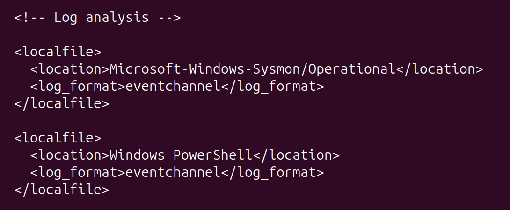
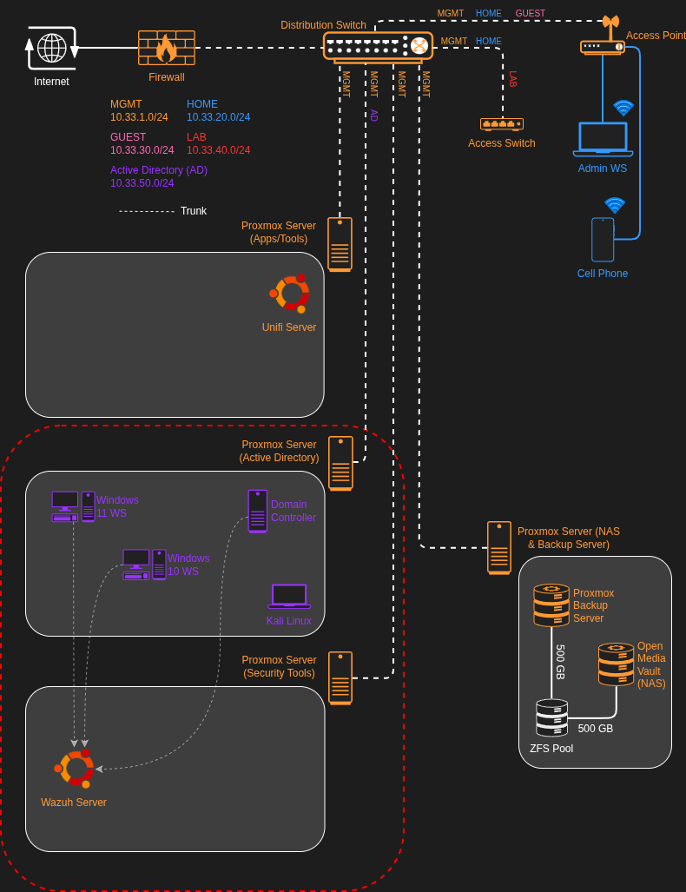
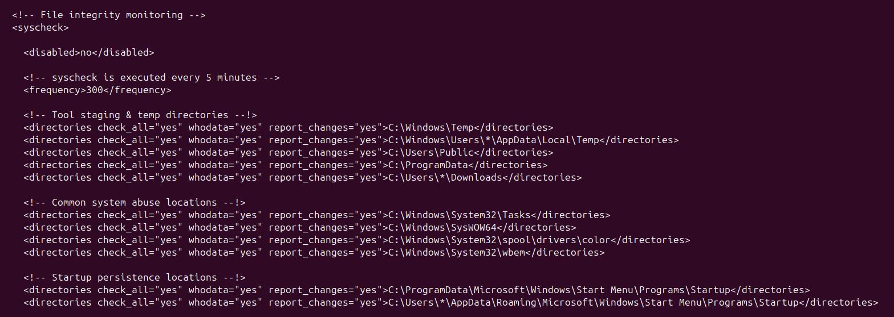
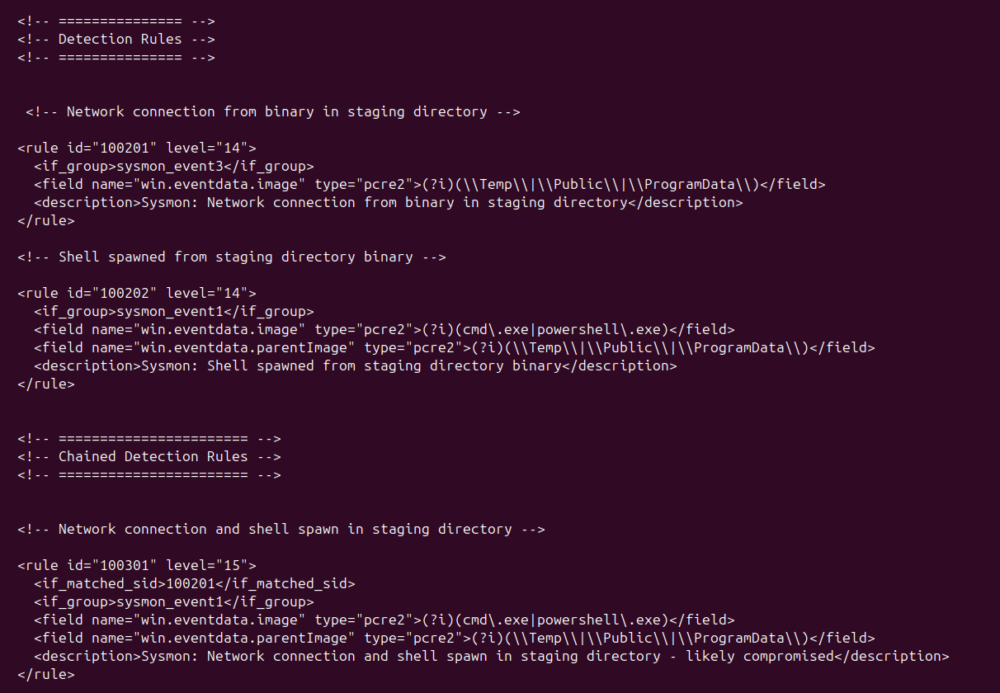
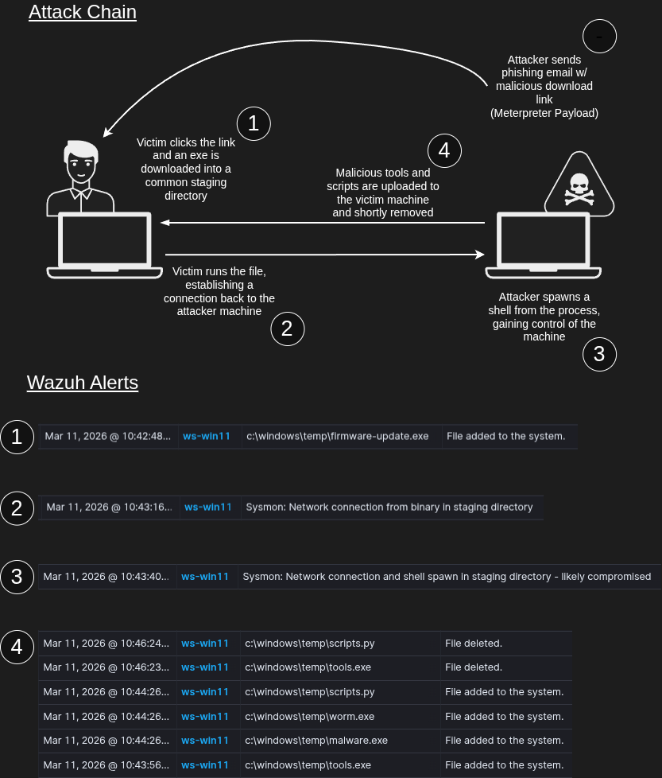
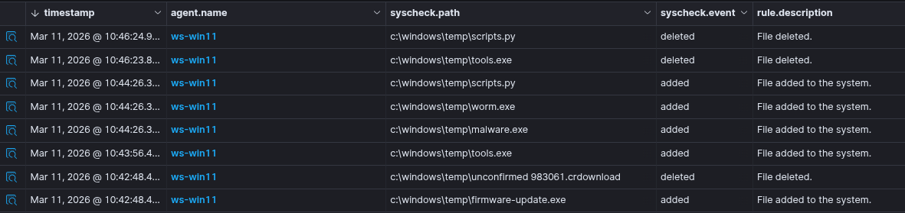
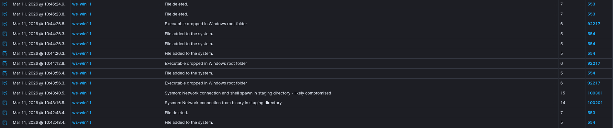

# Wazuh Detection Engineering with Simulated Attack Chain

## Overview

This lab documents the design and validation of a threat detection pipeline built on Wazuh SIEM & EDR within a segmented Active Directory environment. The goal was to engineer custom detection rules capable of identifying a staged malware execution chain, from initial file drop through network callback and shell spawn. These rules were then validated with a simulated attack using Kali Linux.

## Architecture & Data Flow

### Log Flow

Three endpoints are monitored by the SIEM w/ the following log sources
- Sysmon
- Windows events (security, application, system)
- Raw PowerShell logs
- Wazuh default log ingestion

### Network Diagram

- For more details on how the lab is designed, see the full [Wazuh SIEM & EDR Implementation](https://github.com/ncbarrett90/cybersecurity-lab/blob/main/labs/wazuh-edr-implementation/wazuh-edr-implementation.md) writeup 

## Wazuh Server Engineering

### File Integrity Monitoring (FIM)
- Configured on each agent
- Monitoring directories used commonly for tool staging, system abuse, and persistence implementation
- Actively generates alerts when changes are made to these directories
- Includes additional whodata, showing detailed information about who and what process generated the alert

### Threat Detection
- Configured three rules (directly on the server) specific to the following events
    - Network connection from binary in a staging directory
    - Shell spawned from a staging directory binary
    - Critical event if both the previous events occur within a short period of time
- This will send custom alerts if these events trigger and allow for further investigation/remediation

## Key Security Configurations

| Area | Configuration | Security Purpose | Notes |
|---------|-----------------------|---------------------------|-----------|
| FIM | whodata="yes" on all monitored dirs | captures who and what process made file changes, not just what changed | requires Windows audit policy enabled |
| FIM | report_changes="yes" | shows exact content of file changes | increases log volume |
| FIM | staging dir monitoring | detects tools dropped to common attacker staging locations | covers Temp, Public, ProgramData, Downloads |
| FIM | persistence location monitoring | detects files written to startup folders | covers both user and system startup paths |
| FIM | system abuse location monitoring | detects tampering with sensitive system directories | covers SysWOW64, NTDS, SYSVOL, Tasks |
| FIM | noise reduction regex | filters .log .tmp .etl files to reduce false positives | keeps alert volume manageable |
| Detection | Sysmon Event 1 rule (100202) | detects cmd/powershell spawned from staging directory binary | intend to map to MITRE |
| Detection | Sysmon Event 3 rule (100201) | detects network connections from staging directory binaries | Intend to Map to MITRE |
| Detection | chained rule (100301) | critical alert when both network connection and shell spawn occur within 5 minutes | high confidence compromise indicator |

## Validation & Evidence

- Test performed: Simulated staged malware execution chain from Kali Linux against Windows endpoints
- Expected result: FIM alert on file drop & tool upload, individual Sysmon alerts on network connection and shell spawn, critical chained alert when both occur
- Actual result: FIM alert fired on file drop and tool upload to staging directory, network connection rule (100201) fired, chained rule (100301) fired combining both detections into a single critical alert
- Evidence (screenshots / logs):

### Filtered logs (corresponding to the attack chain performed above)

**FIM Monitoring**

**Threat Detection using Sysmon & Custom Rules**

**Note:** Individual shell spawn rule (100202) was suppressed by the higher confidence chained rule (100301) when both conditions were met simultaneously - expected behavior that reduces alert fatigue

## Challenges

- **Rule file permissions**: Custom rule files created via SSH were owned by the wrong user, causing the Wazuh API to return 500 errors when loading the rules page. Resolved by ensuring all rule files in /var/ossec/etc/rules/ are owned by wazuh:wazuh
- **Backup file interference**: A backup of the rules file with a .xml extension was being parsed by Wazuh, causing permission errors. Resolved by renaming to .bak extension
- **timeframe tag incompatibility**: The timeframe tag is not supported with if_matched_sid in Wazuh, causing the manager to fail on startup. Resolved by removing the timeframe tag from the chained rule and restarting the manager
- **Nano compatibility**: Nano behaved unexpectedly over SSH on the Windows 10 agent. Resolved by installing vim via Chocolatey on all windows machines for text editing w/ copy and paste

## Future Enhancements

- **Additional detections**: Expand Sysmon ruleset to cover LOLBin abuse, persistence via registry run keys, and lateral movement
- **MITRE ATT&CK mapping**: Tag all rules with corresponding ATT&CK technique IDs for better alert context and reporting
- **Wazuh agent groups**: Migrate from individual agent configuration to centrally managed groups (workstations vs DC) to simplify config management at scale
- **Splunk integration**: Implement Splunk as the main SIEM and forward Wazuh EDR logs

## Next Project

My next project will expand on the custom rules configured in this lab. I want to dig deeper and gather more information about the attack, and create additional rules to gain more insight into what is happening on these endpoints. 

I will also perform other attacks and create rules to detect these different vectors. My goal with this is to develop both blue and red team skills while building a holistic understanding of cybersecurity.