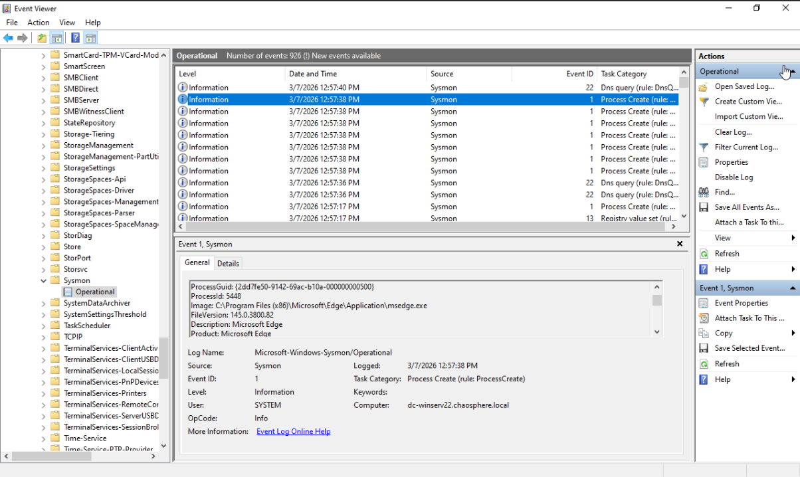
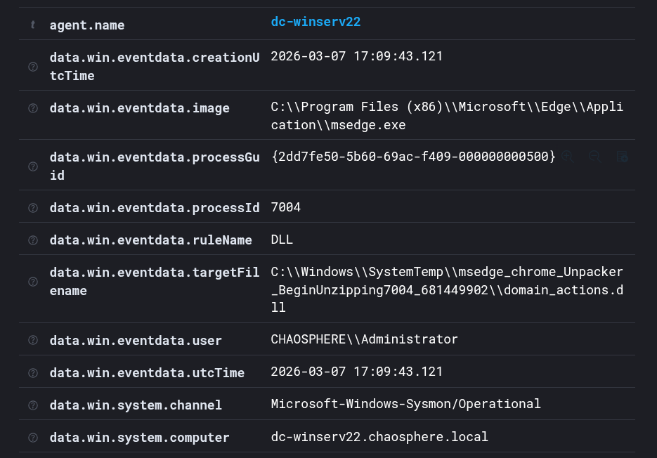

# Wazuh Endpoint Detection and Response Implementation (EDR)

## Overview

This lab outlines the process I took for implementing Wazuh, an endpoint detection & response (EDR) platform that provides extensive endpoint security features in a server/agent architecture. EDR systems offer visibility into different events occurring on endpoint devices such as process creations, network connections, critical file changes, and more. This lab focuses on the Wazuh server deployment, connecting endpoints in my lab environment to the server, and improving the ingested log quality through the addition of Sysmon. 

The purpose of this is to get more familiar with how these tools are configured and used to monitor and secure enterprise networks. Future labs will include additional configurations and integrations with other tools such as Splunk, Nessus, and Snort. I also intend to monitor these tools while simulating different security incidents to see what type of information can be seen during and after.

## Architecture & Data Flow

### Testing Environment
- Three machines will be monitored by the security stack I am standing up due to hardware limitations
- Endpoints and security tools sit on different subnets to segment traffic
- Sysmon is installed on endpoints and logs are forwarded to the Wazuh server
- All devices reside on Proxmox hosts as virtual machines

### Network Diagram

## Key Security Configurations

| Area | Configuration | Security Purpose | Notes |
|---------|-----------------------|---------------------------|-----------|
| Segmentation | endpoints & security tools are on different subnets/hypervisors | prevents lateral movement | all tools reside on MGMT subnet | 
| EDR/XDR Implementation | server/agent design for central log ingestion & correlation | provides greater visibility and endpoint monitoring & response capabilities | additional configuration is required for alerts, FIM, etc. |
| Sysmon Logging | installed and added Sysmon logging to the Wazuh agent ingestion | provides better logging for common security events | requires manually adding to Wazuh agent ingestion config |
| Access Control | Wazuh server GUI and SSH are tightly controlled | prevents unauthorized access | common practice on all machines |
| Additional Security Capabilities | FIM, config management, malware detection, etc. | provides enterprise grade endpoint security features | requires more training/configuration to be more effective |

## Validation & Evidence

- Test performed: Start Microsoft Edge and located the Sysmon log in the local Event Viewer and Wazuh dashboard
- Expected result: A log entry with the the ID of 1 will be present showing the Edge process creation
- Actual result: The log was present in both locations
- Evidence (screenshots / logs):

## Challenges

The primary challenge in this lab was ensuring that the firewalls were correctly configured to allow communication between the endpoints on the Active Directory subnet and the Wazuh server on the MGMT subnet. Additionally, since these virtual machines were hosted on different Proxmox hypervisors, the necessary ports had to be opened on each hypervisor as well.

- Traffic was allowed from the AD subnet to the MGMT subnet
- Traffic was allowed into the Proxmox server that is hosting the Wazuh Server
- The firewall on the Ubuntu server that Wazuh is running on was the final layer and traffic was allowed in

## Future Enhancements

- Forward logs from Wazuh to Splunk for central log correlation for all security tools
- Implement FIM on critical directories on the Windows endpoints
- Address configuration management alerts and determine if vulnerabilities Wazuh detected are true positives
- Add alerts for specific logs to monitor security events in real time
- Simulate security events to light up logging and practice investigative techniques

## Next Project

The next project I intend to work on will be implementing file integrity monitoring for critical directories in my Active Directory lab environment. I will then simulate how attackers may interact with these directories such as installing tools, added persistence mechanisms, and changing system files. This should light up the logs and allow me to get hands on with investigating and remediating incidents.

